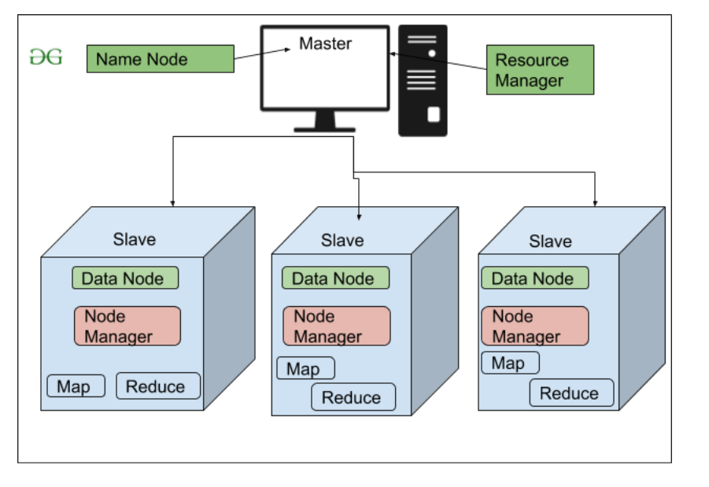

# Hadoop Cluster Setup
This project focuses on setting up Hadoop Cluster for learning environment.

## Setup
 

-- Namenode

-- 3 Datanode

## Prerequisites
Java => openjdk version "1.8.0_412"

Redhat => 9.2

Hadoop => 3.4.0

## Installation
This installation will be for learning so I will disable the firewall on all nodes
### 1- firewall
#### All Nodes
~~~bash 
systemctl stop firewalld.service #Stop firewall Service
~~~ 
~~~bash 
systemctl disable firewalld.service # Disable the Firewall service,
~~~
### 2- Hostname, DNS, and Hadoop User 
You can use differnt IPs based on your network
#### NamdeNode
Change the hostname for master node
~~~bash 
hostnamectl hostname master
~~~
Edit the hosts file to add DNS record for all nodes
~~~bash 
vi /etc/hosts
~~~
~~~dns 
  192.168.83.240  master  # Add this records to /etc/hosts
  192.168.83.241  node1   # Add this records to /etc/hosts
  192.168.83.242  node2   # Add this records to /etc/hosts
  192.168.83.243  node3   # Add this records to /etc/hosts
~~~

~~~bash 
useradd hadoop            # Create Hadoop USer
~~~
~~~bash
passwd hadoop             # Set Password
  :password
~~~
~~~bash
echo "ALL ALL=(ALL) ALL" > /etc/sudoers.d/hadoop  # Add the Hadoop User to superuser
~~~
~~~bash
su - hadoop   # Switch to hadoop user
~~~
#### DataNodes
Change the hostname for worker node which the n is the node number
~~~bash 
hostnamectl hostname nodeN
~~~
Edit the hosts file to add DNS record for all nodes
~~~bash 
vi /etc/hosts
~~~
~~~dns 
  192.168.83.240  master  # Add this records to /etc/hosts
  192.168.83.241  node1   # Add this records to /etc/hosts
  192.168.83.242  node2   # Add this records to /etc/hosts
  192.168.83.243  node3   # Add this records to /etc/hosts
~~~

~~~bash 
useradd hadoop            # Create Hadoop USer
~~~
~~~bash
passwd hadoop             # Set Password
  :password
~~~
~~~bash
echo "ALL ALL=(ALL) ALL" > /etc/sudoers.d/hadoop  # Add the Hadoop User to superuser
~~~
~~~bash
su - hadoop
~~~
### 3- SSH configuration
After Making sure the SSH serive is installed and enabled to all nodes please do below step on the master node
#### Master Node
~~~bash
ssh-keygen -t rsa
~~~
~~~bash
ssh-copy-id hdoop@master # Will ask to enter the password
ssh-copy-id hdoop@192.168.83.240
~~~
~~~bash
ssh-copy-id hdoop@node1 # Will ask to enter the password
ssh-copy-id hdoop@192.168.83.241
~~~
~~~bash
ssh-copy-id hdoop@node2 # Will ask to enter the password
ssh-copy-id hdoop@192.168.83.242
~~~
~~~bash
ssh-copy-id hdoop@node3 # Will ask to enter the password
ssh-copy-id hdoop@192.168.83.243
~~~
### 4- Java installation and Environment Variable
Do below Step for all nodes to install the Java
#### All Nodes
~~~bash  
 sudo dnf install -y java-1.8.0-openjdk-devel
~~~
~~~bash
sudo vi ~/.bashrc   # add below Env Variables  =fo Java to .bashrc

    # java
    export JAVA_HOME=/usr/lib/jvm/java-1.8.0-openjdk
    export PATH=$JAVA_HOME/bin:$PATH
~~~
~~~bash
source ~/.bashrc
~~~

### 5- Download, Install Hadoop and configure Env Variable
#### All Nodes
~~~bash
sudo dnf install -y wget # Downloader
~~~
DownLoad Hadoop Package 3.4.0, if the URL is not working search on the internet and download it
~~~bash
wget https://downloads.apache.org/hadoop/common/hadoop-3.4.0/hadoop-3.4.0.tar.gz
~~~
~~~bash
tar -xzvf hadoop-3.4.0.tar.gz 
~~~
~~~bash
sudo mv hadoop-3.4.0 /usr/local/hadoop
~~~
~~~bash
sudo chown -R hadoop:hadoop /usr/local/hadoop
~~~
~~~bash
sudo vi ~/.bashrc   # add below Env Variables  for Java to .bashrc

    # hadoop
    export HADOOP_HOME=/home/jane/hadoop
    export HADOOP_INSTALL=$HADOOP_HOME
    export HADOOP_MAPRED_HOME=$HADOOP_HOME
    export HADOOP_COMMON_HOME=$HADOOP_HOME
    export HADOOP_CONF_DIR=${HADOOP_HOME}/etc/hadoop
    export HADOOP_HDFS_HOME=$HADOOP_HOME
    export YARN_HOME=$HADOOP_HOME
    export HADOOP_COMMON_LIB_NATIVE_DIR=$HADOOP_HOME/lib/native
    export PATH=$PATH:$HADOOP_HOME/sbin:$HADOOP_HOME/bin
    export HADOOP_OPTS=-Djava.net.preferIOv4stack=true
    export HADOOP_OPTS="-Djava.library.path=$HADOOP_HOME/lib/native"
~~~
~~~bash
source ~/.bashrc
~~~
## Run Locally  

Clone the project  

~~~bash  
  git clone https://link-to-project
~~~

Go to the project directory  

~~~bash  
  cd my-project
~~~

Install dependencies  

~~~bash  
npm install
~~~

Start the server  

~~~bash  
npm run start
~~~

## Contributing  

Contributions are always welcome!  

See `contributing.md` for ways to get started.  

Please adhere to this project's `code of conduct`.  

## License  

[MIT](https://choosealicense.com/licenses/mit/)
